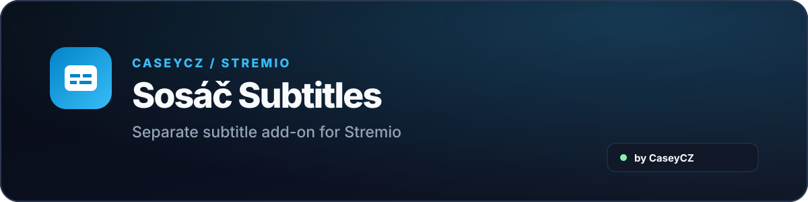

  

  
  

  A separate unofficial community <strong>Stremio</strong> add-on that provides subtitles from <strong>Sosáč.tv</strong> and <strong>Streamuj.tv</strong> sources.

  

  

## About

**Sosáč Subtitles** is a separate add-on focused only on subtitles. It adds subtitles for movies and series in Stremio and works independently from the main video add-on.

## Main features

- 💬 subtitles for movies and series
- 🇨🇿 Czech, Slovak and other languages when available
- 🎞️ subtitles prepared for Stremio playback
- 🔗 title matching using supported identifiers
- ⚡ faster repeated loading
- 🧩 separate add-on that does not alter video stream selection
- 📱 works with common Stremio clients including web, desktop, Android / Google TV and Apple devices

## Related project

For catalogs, metadata and video streams use the main **Stremio Sosáč** add-on.

  
  

## Important

This is an unofficial community add-on and is not officially affiliated with or supported by Stremio, Sosáč.tv or Streamuj.tv. Subtitle availability depends on external services and the specific video.

## Support

  

   
  Scan the QR code or click the button.

  

